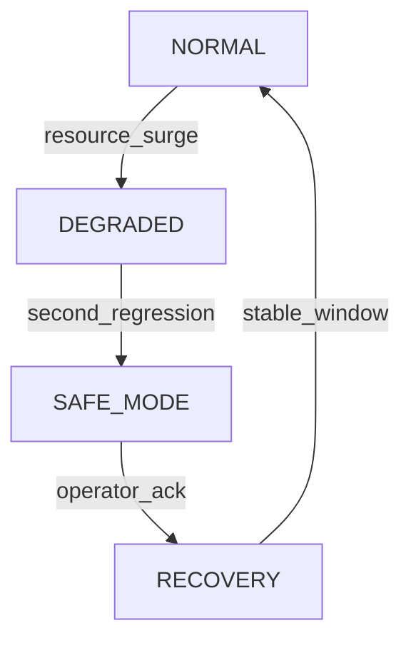

# Failsafe & Logic Gates Design

Status: Draft (Pre-Implementation)
Applies: Phases 2–6 (progressively activated)

## 1. Objectives
Provide layered protection so detection, enrichment, or response failures do not cascade into data loss, false flood, or unauthorized changes. Emphasis on *graceful degradation* and *auditability*.

## 2. Taxonomy of Failure Domains
| Domain | Examples | Impact Vector |
|--------|----------|---------------|
| Ingestion | Source stall, burst overrun, queue saturation | Data latency, drops |
| Detection | Division by zero, state corruption, memory growth | Blind spots, false negatives |
| Adaptive Models (Phase 3+) | SNN drift, encoding mismatch | Alert noise, model invalidity |
| Fusion (Phase 4) | Weight misconfiguration, loop escalation | Confidence distortion |
| Response (Phase 5) | Playbook recursion, external API error | Escalation loop, partial actions |
| Governance | Param tampering, hash mismatch | Integrity erosion |
| Security | Secret exfil attempt, dependency CVE | System compromise |

## 3. Failsafe Layers (Defense-in-Depth)
| Layer | Mechanism | Trigger Condition | Result |
|-------|-----------|------------------|--------|
| L1 Rate Guard | Token bucket | consume() returns False | Event dropped (reason=rate_limit) |
| L2 Queue Backpressure | Bounded queue | put_nowait raises | Drop (reason=queue_full) + metric |
| L3 Detector Warm-Up | Min window size | window < warmup_min | Skip anomaly decision |
| L4 Variance Fallback | MAD fallback | std == 0 and use_mad | Alternate z-like threshold |
| L5 Resource Watchdog | psutil gauges | Memory > threshold | Emit warning + mark degraded |
| L6 Param Validation | Schema constraints | Invalid update attempt | Reject + audit log |
| L7 Hash Integrity Gate | Canonical doc hash mismatch | On startup | Abort startup or WARN (config) |
| L8 Shadow Mode (SNN) | Side-by-side inference | Feature flag on | Results ignored if inconsistent |
| L9 Fusion Safe Mode | Weighted aggregator disabled | Drift/health fail | Revert to baseline only |
| L10 Response Dry-Run | Playbook DSL flagged | Unapproved action | Simulated only + log |
| L11 Circuit Breaker (External) | Error rate threshold | > configured failures | Temporary disable integration |

## 4. State Machine for System Health
States: `NORMAL` -> `DEGRADED` -> `SAFE_MODE` -> `RECOVERY` -> `NORMAL`

Transitions:
- NORMAL -> DEGRADED: resource threshold breach, anomaly flood, evaluation regression.
- DEGRADED -> SAFE_MODE: second consecutive evaluation failure OR hash mismatch.
- SAFE_MODE -> RECOVERY: manual operator ack + passing quick health checks.
- RECOVERY -> NORMAL: stable metrics window (e.g., 15m) achieved.

Implementation Outline:


## 5. Health Check Matrix
| Check | Metric / Signal | Failure Criteria | Escalation |
|-------|-----------------|------------------|------------|
| Memory Pressure | memory_mb gauge | > 750MB for 3 samples | NORMAL->DEGRADED |
| CPU Saturation | cpu_percent | > 85% 5 samples | NORMAL->DEGRADED |
| Anomaly Flood | anomalies/events ratio | > 8% 3 windows | NORMAL->DEGRADED |
| Detection Silence | anomalies/events ratio | < 0.01% 3 windows | NORMAL->DEGRADED |
| Evaluation Regression | F1 delta | drop > 0.1 vs baseline | DEGRADED->SAFE_MODE |
| Hash Integrity | canonical mismatch | mismatch | NORMAL->SAFE_MODE |
| SNN Drift (Phase 3) | embedding distance | > threshold | NORMAL->DEGRADED |

## 6. Degradation Behaviors
| Mode | Behavior |
|------|----------|
| DEGRADED | Increase logging verbosity, disable non-critical detectors (SNN shadow), trigger threshold sweep for recalibration. |
| SAFE_MODE | Only baseline detector active, response automation disabled, param updates require dual-ack (future). |
| RECOVERY | Gradual re-enable (SNN shadow -> fusion -> response). |

## 7. Circuit Breaker Template (External Integration)
```yaml
breaker:
  name: slack_webhook
  error_rate_threshold: 0.15
  min_requests: 20
  open_window_sec: 300
  half_open_after_sec: 120
```

Pseudocode:
```python
if window.requests >= min_requests and window.error_rate > threshold:
    state = OPEN
elif state == OPEN and elapsed > half_open_after:
    state = HALF_OPEN
```

## 8. Threshold Sweep Auto-Assist
When anomaly flood OR silence triggers, auto-run threshold sweep script and attach diff to gate log.

## 9. Audit & Forensics Hooks
- Every state transition logged with: previous_state, new_state, reason_code, metrics_snapshot_hash.
- Parameter changes in DEGRADED or SAFE_MODE require reason + ticket id field.

## 10. Minimal Initial Implementation (Phase 2 Close)
- Document matrix (this file)
- Expose current state via `/plain/summary` (already partial; add health state placeholder)
- Add TODO markers in code for state machine integration.

## 11. Future Enhancements
| Feature | Rationale |
|---------|-----------|
| Signed state transition ledger | Tamper-evident recovery chain |
| Auto memory leak heap diff | Rapid root cause |
| Adaptive window sizing | Stabilize variance estimate under load |

## 12. Open Questions
- Should SAFE_MODE disable parameter updates entirely (read-only) until operator ack? (Likely yes.)
- When SNN uplift negative for N days, auto-disable? (Risk vs experimentation tension.)

## 13. Acceptance Criteria (Phase 2 Documentation)
- All enumerated layers mapped to triggers.
- Clear state definitions & transitions.
- Outlines minimal code integration path.

---
Draft complete; implement incremental gates in subsequent sprints.
